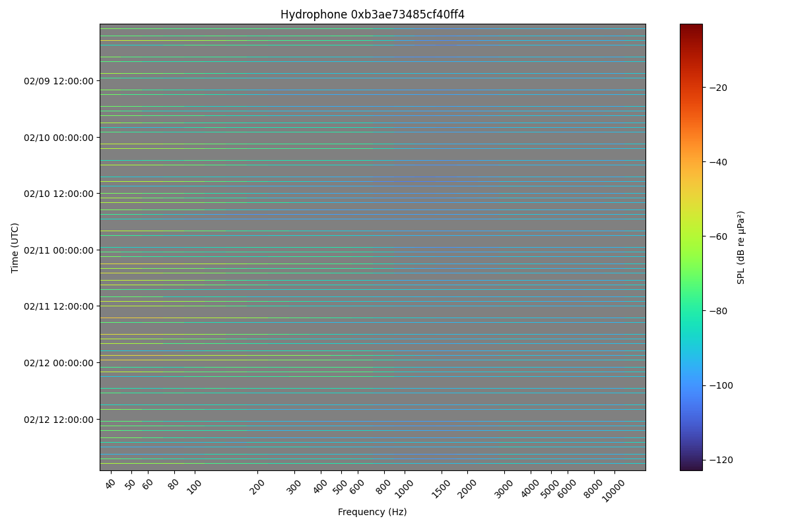
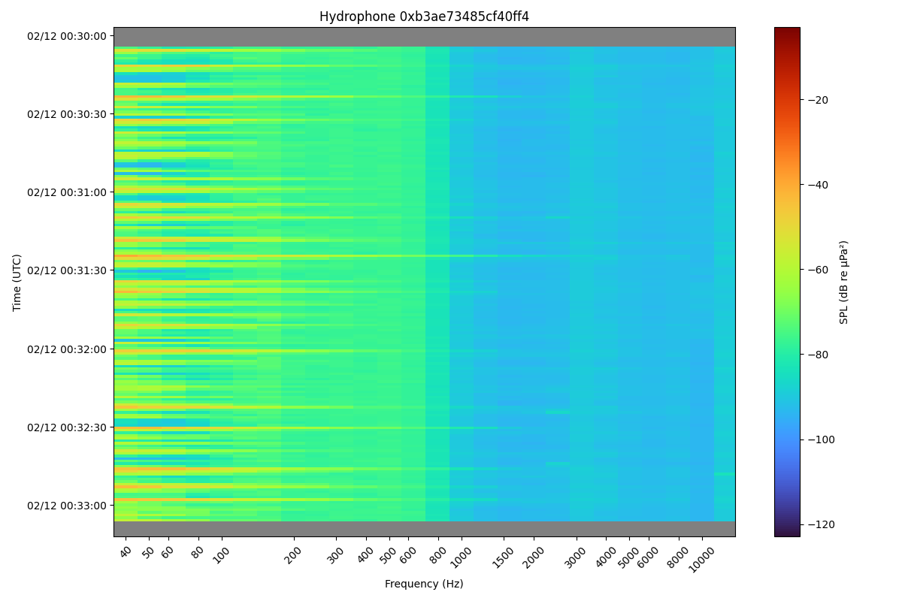

# BOREALIS Tools

Python tools for working with BOREALIS hydrophones and Spotter Sound systems.

## Overview

This repository contains tools for parsing and visualizing acoustic data from BOREALIS devices. BOREALIS measures sound pressure levels (SPL) in dB re µPa² across multiple frequency bands.

More technical details about BOREALIS:

- [BOREALIS Wiki](https://github.com/appliedoceansciences/borealis/wiki)
- [SCARI Wiki](https://github.com/appliedoceansciences/scari/wiki)
- [scari_tools](https://github.com/appliedoceansciences/scari_tools)

## Tools

### 1. Data Parser (`parse_borealis_data.py`)

Parses base64-encoded acoustic data into CSV format.

**Features:**
- Parses three data types: spectrum, statistics, and pgram
- Supports ANSI S1.11 nominal midband frequencies (40 Hz to 20 kHz)
- Automatic data type detection
- Reads from stdin, writes to stdout

**Requirements:**
- Python 3.x (no external dependencies)

### 2. Spectrogram Plotter (`plot_spectrogram_from_json.py`)

Plots spectrograms from Sofar Ocean API JSON data containing 1-second SPL readings.

**Features:**
- Reads JSON from stdin or file
- Expects JSON format from Sofar Ocean sensor-data API endpoint
- Creates interactive spectrograms with zoom/pan
- Handles multiple hydrophones (separate plot per node)
- Shows data gaps in gray

**Requirements:**
- Python 3.x
- matplotlib
- numpy

Install dependencies:
```bash
pip install -r requirements.txt
```

## Usage

### Data Parser

**Basic usage:**
```bash
echo "<base64_string>" | python parse_borealis_data.py
```

**Specify data type:**
```bash
echo "<base64_string>" | python parse_borealis_data.py --data-type spectrum
```

**Process file:**
```bash
cat data.txt | python parse_borealis_data.py > output.csv
```

### Spectrogram Plotter

Example JSON data from the Sofar Ocean API is in `assets/sensor-data.json`.

See the [sensor-data API documentation](https://docs.sofarocean.com/spotter-and-smart-mooring/smart-mooring/sensor-data)

**Read from file:**
```bash
./plot_spectrogram_from_json.py sensor-data.json
```

**Read from stdin:**
```bash
cat sensor-data.json | ./plot_spectrogram_from_json.py
```

**Custom parameters:**
```bash
./plot_spectrogram_from_json.py --iband-start 16 --dt 0.983 sensor-data.json
```





## Data Format Reference

### Parser Output Formats

**Spectrum:** Frequency (Hz), SPL (dB)
**Statistics:** Frequency (Hz), Q1, Q2, Q3, Mean (all in dB)
**Pgram:** Frequency (Hz), SPL (dB)

### Frequency Bands

**Spectrum/Statistics:** ANSI S1.11 standard frequencies (40 Hz to 20 kHz)
**Pgram:** Hybrid linear/logarithmic spacing with 24 bands per octave

## Testing

Run the parser tests:

```bash
python test_parse_borealis_data.py
# or
python run_tests.py
```
